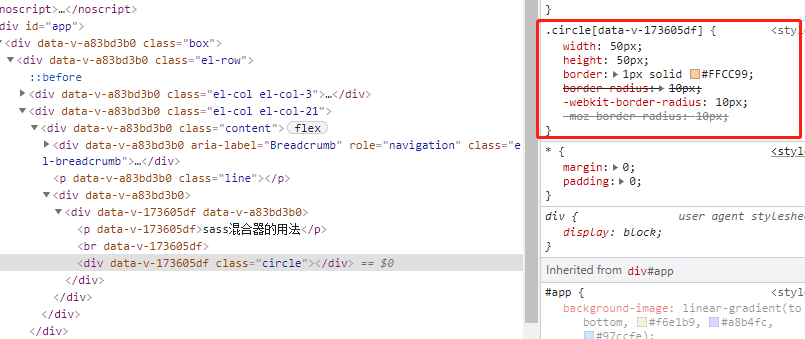

### 1.使用变量
```
1-1. 变量声明
eg: $theme-color: #f90;
eg: $link-color: blue;
a {
color: $link_color;
}
编译后
a {
color: blue;
}
$link-color和$link_color其实指向的是同一个变量。
```

### 2.嵌套CSS 规则
```angular2html
2-1. 父选择器的标识符&
eg:
<div class="article">
  <a href=""> 我是a链接</a>
</div>
<style lang="scss">
  .article {
    a {
      color: $base-font-t-color;
      &:hover {
         color: $base-font-d-color;
       }
    }
  }
</style>

2-2. 嵌套属性
规则：把属性名从中划线-的地方断开，在根属性后边加一个冒号：，紧跟一个{}，把子属性部分写在{}中
eg:
<style>
  .border {
    width: 50px;
    height: 50px;
    border: {
      style: solid;   // border-style: solid;
      color: #42b983;  // border-color: #42b983;
      width: 2px;   // border-width: 2px;
    }
  }
  -------------------------------------------------------------------
  .border {
    width: 50px;
    height: 50px;
    border: 1px solid #42b983 { //border: 1px solid #42b983;
      left: 0px;  //border-left: 0px;       
      right: 0px;  //border-right: 0px;
    }
  }
  
</style>
```

### 3. 导入sass文件
```angular2html
@import规则: 允许在一个css文件中导入其他css文件
  css: 只有执行到@import时，浏览器才会去下载其他css文件，这导致页面加载起来特别慢。
  sass: @import在生成css文件时就把相关文件导入进来，这也意味着所有相关的样式被归纳到了同一个css文件中，而无需发起额外的下载请求。

（1）使用sass部分文件
sass局部文件的文件名是以下划线开头，这样，sass就不会在编译时单独编译这个文件输出css，而只是把这个文件用作导入

（2）默认变量值
 !default标签：用于变量，含义是：如果这个变量被声明赋值了，那就用它声明的值，否则就用这个默认值

eg:
<div class="fancybox">
  <p>导入sass文件</p>
</div>
<style lang="scss" scoped>
  @import "../common/import-file";  //引入局部文件
  $fancybox-width: 400px !default;  // .fancybox div的宽度为200px
  $fancybox-width: 400px;  // .fancybox div的宽度为400px, 局部文件设置的值无效
  .fancybox {
    background-color: #FFCC99;
    width: $fancybox-width;
  }
</style>

<!--局部sass文件 _import-file.scss-->
$fancybox-width: 200px;
-------------------------------------------------------------------

（3）嵌套导入
跟原生的css不同，sass允许@import命令写在css规则内。
这种导入方式下，生成对应的css文件时，局部文件会被直接插入到css规则内导入它的地方。
eg:
<div class="blur-theme">
  <p class="aside">
    嵌套导入
  </p>
</div>
<style lang="scss" scoped>
  /*sass*/
  .blur-theme {@import "../common/blue-theme";}
  /*css*/
  .blur-theme {
    .aside {
      background: blue;
      color: white;
    }
  }
</style>

<!--局部sass文件 _blue-theme.scss-->
.aside {
  background: blue;
  color: white;
}
-------------------------------------------------------------------

(4) 原生的css导入
sass兼容原生的css，所以它也支持原生的css@import。
通常在sass中使用@import时，sass会尝试找到对应的sass文件并导入进来，但在下列三种情况下会生成原生的css@import，会造成浏览器解析时额外下载：
· 被导入文件的名字以.css结尾；
· 被导入文件的名字是一个URL地址
· 被导入文件的名字是css是url()值
```

### 4. 静默注释
```angular2html
css中注释：对已写样式的简单说明，便于日后查阅，但是，当在浏览器中查看网页源码时,可以看到所有的注释；
sass提供了另外一种不同于css标准注释格式/*...*/的注释语法，即静默注释，其内容不会出现在生成的css文件中。静默注释的语法跟Javascript Java等类C的语言中单行注释的语法相同，
它们以//开头，注释内容直到行末。

eg:
<style>
  .silentNotes {
    width: 100px;
    height: 20px;  // sass注释，不会出现在生成的css文件中
    background-color: #9a7272; /* 这种注释会出现在生成的css文件中 */
  }
</style>

实际上，css的标准格式/*...*/内的注释可以被抹去。当注释出现在原生css不允许的地方，如在css属性或选择器中，sass将不知如何将其生成到对应css文件中的相应位置，于是这写注释被抹掉
eg:
<style>
  body {
    color /* 这块注释内容不会出现在生成的css中 */: #333;
    padding: 1; /* 这块注释内容也不会出现在生成的css中 */ 0;
  }
</style>
```

### 5.混合器
```angular2html
混合器使用@mixin标识符定义：这个标识符给一段样式赋予一个名字，这样就可以轻易地通过引用这个名字重用这段样式。
eg:
sass代码：定义一个混合器，添加跨浏览器的圆角边框
@mixin rounded-corners {
  -moz-border-radius: 5px;
  -webkit-border-radius: 5px;
  border-radius: 5px;
}

在样式表中通过@include来使用这个混合器，放在希望的任何地方。
 @include调用会把混合器中的所有样式提取出来放在@include被调用的地方。
 eg:

<style scoped lang="scss">
  @mixin rounded {
    border-radius: 10px;
    -webkit-border-radius: 10px;
    -moz-border-radius: 10px;
  }
  .circle {
    width: 50px;
    height: 50px;
    border: 1px solid #FFCC99;
    @include rounded;
  }
</style>

<!--css生成-->


（1）混合器适用场景
利用混合器，可以很容易地在样式表的不同地方共享样式。大量的重用可能会导致生成的样式表过大，导致加载缓慢。
  *混合器在某些方面和css类很像。但是，类名是在HTML文件中应用，而混合器是在样式表中应用的；
  *sass同样允许把css规则放在混合器中。
（2）混合器中的参数是规则
混合器中不仅可以包含属性，也可以包含css规则，包含选择器和选择器中的属性
eg:
@mixin no-bullets {
  list-style: none;
  li {
    list-style-image: none;
    list-style-type: none;
    margin-left: 0px;
    }
  }
当一个包含css规则的混合器通过@include包含在一个父规则中时,在混合器中的规则最终会生成父规则中的嵌套规则。
eg:
ul.plain {
  color: #444;
  @include no-bullets;
}
sass的@include指令会将引入混合器的那行代码替换成混合器里面的内容。最终，上边的代码会生成如下的css文件：
ul.plain {
  color: #444;
  list-style: none;
}
ul.plain li {
  list-style-image: none;
  list-style-type: none;
  margin-left: 0px;
}

（3）给混合器传参
通过@include混合器时给混合器传参，来制定混合器生成的精确样式。
当@include混合器传参时，参数其实就是可以赋值给css属性的变量，这种方式和JS中的函数很像
eg:
@mixin link-color($normal, $hover, $visited){
  color: $normal;
  &:hover {
    color: $hover
  }
  &:visited {
    color: $visited
  }
}
在混合器@include时，可以把它当做一个css函数老传参。
a {
  @include link-color(blue, red, green);
}
<!--sass最终生成的是：-->
a { color: blue; }
a:hover { color: red; }
a:visited { color: green; }

@include混合器时，sass允许通过语法$name:value的形式指定每个参数的值。这种形式，参数的顺序可以打乱，但是参数不能缺失
a {
  @include link-colors(
    $normal: blue,
    $visited: green,
    $hover: red
  );
}

(4)默认参数值
为了在@include混合器时不必传入所有的参数，我们可以给参数指定一个默认值。
参数默认值使用$name: default-value的声明形式，默认值可以是任何有效的css属性值，甚至是其他参数的引用
eg:
@mixin link-colors(
  $normal,
  $hover: $normal,
  $visited: $normal
  )
  {
    color: $normal;
    &:hover { color: $hover; }
    &:visited { color: $visited; }
  }

调用时：@include link-colors(red)   // $hover和$visited也会被自动赋值为red。
```

### 6.使用选择器继承来精简css
选择器继承是说一个选择器可以继承为另一个选择器定义的所有样式。
可通过@extend语法实现
eg:
//通过选择器继承继承样式
.error {
    border: 1px solid red;
    background-color: #fdd;
}
.seriousError {
    @extend .error;
    border-width: 3px;
}

.seriousError将会继承样式表中任何位置处为.error定义的所有样式。
以class="seriousError" 修饰的html元素最终的展示效果就好像是class="seriousError error"。
相关元素不仅会拥有一个3px宽的边框，而且这个边框将变成红色的，这个元素同时还会有一个浅红色的背景，因为这些都是在.error里边定义的样式。
.seriousError不仅会继承.error自身的所有样式，任何跟.error有关的组合选择器样式也会被.seriousError以组合选择器的形式继承.
eg：
//.seriousError从.error继承样式
.error a{  //应用到.seriousError a
    color: red;
    font-weight: 100;
}
h1.error { //应用到hl.seriousError
    font-size: 1.2rem;
}

-----------------
因为继承是基于类的（有时是基于其他类型的选择器），所以继承应该是建立在语义化的关系上。
任何css规则都可以继承其他规则，几乎任何css规则也都可以被继承。
跟混合器相比，继承生成的css代码相对更少。因为继承仅仅是重复选择器，而不会重复属性，所以使用继承往往比混合器生成的css体积更小。如果你非常关心你站点的速度，请牢记这一点。
继承遵从css层叠的规则。当两个不同的css规则应用到同一个html元素上时，并且这两个不同的css规则对同一属性的修饰存在不同的值，css层叠规则会决定应用哪个样式。相当直观：通常权重更高的选择器胜出，如果权重相同，定义在后边的规则胜出。
